## 1. 卷积（Cov）
卷积操作直观理解即为，卷积核大小范围内对应位置数据相乘再相加。
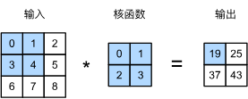
输出大小略小于输入大小。这是因为卷积核的宽度和高度大于1， 而卷积核只与图像中每个大小完全适合的位置进行互相关运算。所以，输出大小等于输入大小$n_h \times n_w$减去卷积核大小$k_h \times k_w$，即：
$$
(n_h-k_h+1) \times(n_w-k_w+1)
$$
代码表示为：
```python
def corr2d(X, K):  #@save
    """计算二维互相关运算"""
    h, w = K.shape
    Y = torch.zeros((X.shape[0] - h + 1, X.shape[1] - w + 1))
    for i in range(Y.shape[0]):
        for j in range(Y.shape[1]):
            Y[i, j] = (X[i:i + h, j:j + w] * K).sum()
    return Y

X = torch.tensor([[0.0, 1.0, 2.0], [3.0, 4.0, 5.0], [6.0, 7.0, 8.0]])
K = torch.tensor([[0.0, 1.0], [2.0, 3.0]])
corr2d(X, K)
```
输出：
```
tensor([[19., 25.],
        [37., 43.]])
```
在卷积神经网络中，==卷积核和偏置都是可学习==的因此我们将类定义为：
```python
class Conv2D(nn.Module):
    def __init__(self, kernel_size):
        super().__init__()
        self.weight = nn.Parameter(torch.rand(kernel_size))
        self.bias = nn.Parameter(torch.zeros(1))

    def forward(self, x):
        return corr2d(x, self.weight) + self.bias
```
在卷积神经网络中，对于某一层的任意元素$x$，其**感受野**（receptive field）是指在前向传播期间可能影响$x$计算的所有元素（来自所有先前层）。
假设$3\times 3$矩阵经过$2\times 2$卷积之后得到输出$Y$其大小为$2\times2$，现在我们在其后附加一个卷积层，该卷积层以为$Y$输入，输出单个元素$z$。 在这种情况下，$Y$上$z$的的感受野包括的所有四个元素，而输入$Y$的感受野包括最初所有九个输入元素。 因此，当一个特征图中的任意元素需要检测更广区域的输入特征时，我们可以构建一个更深的网络。
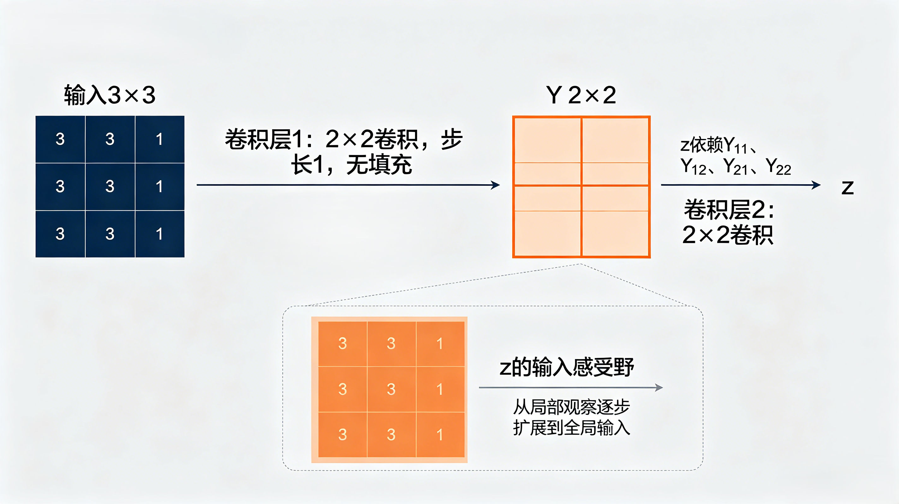
### 1.1 填充
在应用多层卷积时，我们常常丢失边缘像素。 由于我们通常使用小卷积核，因此对于任何单个卷积，我们可能只会丢失几个像素。 但随着我们应用许多连续卷积层，累积丢失的像素数就多了。 解决这个问题的简单方法即为**填充（padding）**：在输入图像的边界填充元素（通常填充元素是0）。
如果我们添加行填充$p_{h}$和列填充$p_{w}$，则输出形状将为:
$$
(n_h-k_h+p_{h}+1) \times(n_w-k_w+p_{w}+1)
$$
当$p_{h}=k_{h}-1,p_{w}=k_{w}-1$时，卷积后输出和输入的大小相同。
### 1.2 步幅
卷积窗口从输入张量的左上角开始，向右、向下滑动。 在前面的例子中，我们默认每次滑动一个元素。 但是，有时候为了高效计算或是缩减采样次数，卷积窗口可以跳过中间位置，每次滑动多个元素。
当垂直步幅为$s_{h}$、水平步幅为$s_{w}$时，输出形状为:
$$
\left\lfloor \frac{n_h - k_h + p_h + s_h}{s_h} \right\rfloor \times \left\lfloor \frac{n_w - k_w + p_w + s_w}{s_w} \right\rfloor
$$
### 1.3 多通道输入输出
当我们的输入有多个通道时，我们的卷积核也要相应的匹配相同的通道数，假设输入为$c\times x \times y$,那么卷积和也需要有$c$个通道，并且一组卷积核最后卷积出的结果只有一个通道。
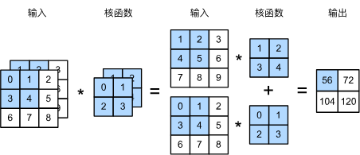
要实现多通道输出，则需要有多组通道为$c$的卷积核。
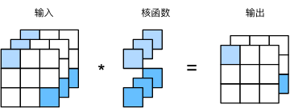
总结一下，对于二维卷积：
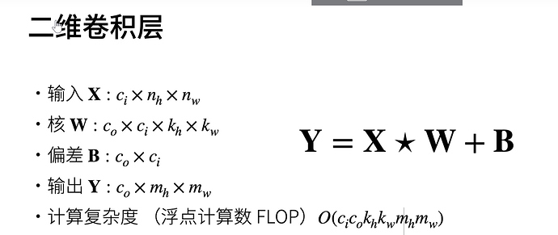
## 2. 池化（Pooling）
池化层有两个目的：降低卷积层对位置的敏感性，同时降低对空间降采样表示的敏感性。
我们通常使用的池化有两种：
- **最大池化（maximum pooling）**：寻找池化窗口内的最大值
-  **平均池化（average pooling）**：寻找池化窗口内的平均值
以下是最大池化的示意图：
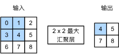
与卷积层一样，汇聚层也可以改变输出形状。和以前一样，我们可以通过填充和步幅以获得所需的输出形状。
### 2.1 填充和步幅
默认情况下，深度学习框架中的步幅与汇聚窗口的大小相同。 因此，如果我们使用形状为`(3, 3)`的汇聚窗口，那么默认情况下，我们得到的步幅形状为`(3, 3)`。
```python
X = torch.arange(16, dtype=torch.float32).reshape((1, 1, 4, 4))
X
```

```
tensor([[[[ 0.,  1.,  2.,  3.],
          [ 4.,  5.,  6.,  7.],
          [ 8.,  9., 10., 11.],
          [12., 13., 14., 15.]]]])
```

```python
pool2d = nn.MaxPool2d(3)
pool2d(X)
```

```
tensor([[[[10.]]]])
```
当然填充和步幅也可以手动设定
```python
pool2d = nn.MaxPool2d(3, padding=1, stride=2)
pool2d(X)
```

```
tensor([[[[ 5.,  7.],
          [13., 15.]]]])
```
其中：
- **`padding=1`**：在输入的高度和宽度方向**四周各填充一行/列**
- **`stride=2`**：窗口在高度方向（向下）和宽度方向（向右）每次移动的步长都是 2。

当然，我们可以设定一个任意大小的矩形汇聚窗口，并分别设定填充和步幅的高度和宽度。
```python
pool2d = nn.MaxPool2d((2, 3), stride=(2, 3), padding=(0, 1))
pool2d(X)
```

```
tensor([[[[ 5.,  7.],
          [13., 15.]]]])
```
其中：
- `stride=(2, 3)`表示高度方向每次向下移动 2 行，宽度方向每次向右移动 3 列。
- `padding=(0, 1)`表示在输入上下填充0行，在输入的左右填充1列
### 2.2多通道输入输出
在处理多通道输入数据时，池化层在每个输入通道上单独运算，而不是像卷积层一样在通道上对输入进行汇总。 这意味着池化层的输出通道数与输入通道数相同。
## 3. 批量规范化
批量规范化应用于单个可选层（也可以应用到所有层），其原理如下：在每次训练迭代中，我们首先规范化输入，即通过减去其均值并除以其标准差（**Zscore标准化**），其中两者均基于当前小批量处理。 接下来，我们应用比例系数和比例偏移。
`值得注意的是，如果我们对批量大小为1的数据进行批量规范化，我们将无法学到任何东西。 这是因为在减去均值之后，每个隐藏单元将为0。 所以，只有使用足够大的，批量规范化这种方法才是有效且稳定的。 在应用批量规范化时，批量大小的选择可能比没有批量规范化时更重要。`
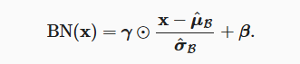
其中
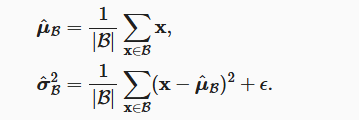
我们在方差估计值中添加一个小的常量$\epsilon>0$，以确保我们永远不会尝试除以零。
在Pytorch中可以使用`nn.BatchNorm2d`来进行批量归一化
## 4. ResNet
随着网络结构的不断加深，如果在一开始学习时模型就**偏离了目标**，那么在经过多层学习后的预测函数会和目标函数有较大的差距，并且随着网络的不断加深，当反向传播时梯度很小的话容易出现**梯度消失**的情况。为了解决上述问题，残差网络（ResNet）应运而生。
### 4.1 残差块
原先我们希望通过输入$x$学习出其对应的映射$f(x)$，二引入残差的思想后，我们虚线部分需要学习的就是$f(x)-x$，在现实中$f(x)-x$往往更容易优化
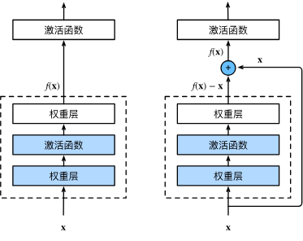
ResNet沿用了完整$3\times3$的卷积层设计。 残差块里首先有2个有相同输出通道数的$3\times3$卷积层。 每个卷积层后接一个批量规范化层和ReLU激活函数。 然后我们通过跨层数据通路，跳过这2个卷积运算，将输入直接加在最后的ReLU激活函数前。 这样的设计要求2个卷积层的输出与输入形状一样，从而使它们可以相加。 如果想改变通道数，就需要引入一个额外的$1\times1$卷积层来将输入变换成需要的形状后再做相加运算。 残差块的实现如下：
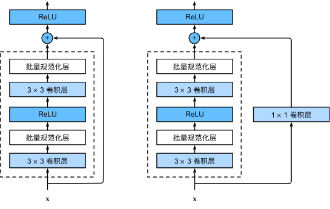
### 4.2 ResNet网络
ResNet的前两层在输出通道数为64、步幅为2的$7\times7$卷积层后，接步幅为2的的$3\times3$最大汇聚层。 不同之处在于ResNet每个卷积层后增加了批量规范化层。以下为ResNet-18的模型结构图：
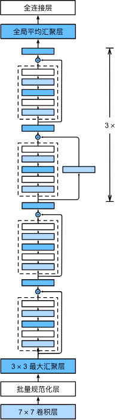
代码实现如下：
```python
def resnet_block(input_channels, num_channels, num_residuals,
                 first_block=False):
    blk = []
    for i in range(num_residuals):
        if i == 0 and not first_block:
            blk.append(Residual(input_channels, num_channels,
                                use_1x1conv=True, strides=2))
        else:
            blk.append(Residual(num_channels, num_channels))
    return blk
    
b1 = nn.Sequential(nn.Conv2d(1, 64, kernel_size=7, stride=2, padding=3),
                   nn.BatchNorm2d(64), nn.ReLU(),
                   nn.MaxPool2d(kernel_size=3, stride=2, padding=1))
b2 = nn.Sequential(*resnet_block(64, 64, 2, first_block=True))
b3 = nn.Sequential(*resnet_block(64, 128, 2))
b4 = nn.Sequential(*resnet_block(128, 256, 2))
b5 = nn.Sequential(*resnet_block(256, 512, 2))

net = nn.Sequential(b1, b2, b3, b4, b5,
                    nn.AdaptiveAvgPool2d((1,1)),
                    nn.Flatten(), nn.Linear(512, 10))
```
当我们不知道模型输出结果大小时，我们可以使用torchinfo库来查看特定输入时模型的输出，例如我们想知道(1，1，224，224)的输入经过$b_{1}$后的输出结果，我们就可以使用`torchinfo.summary(b1.(1,1,224,224))`来获取
```
==========================================================================================
Layer (type:depth-idx)                   Output Shape              Param #
==========================================================================================
Sequential                               [1, 64, 56, 56]           --
├─Conv2d: 1-1                            [1, 64, 112, 112]         3,200
├─BatchNorm2d: 1-2                       [1, 64, 112, 112]         128
├─ReLU: 1-3                              [1, 64, 112, 112]         --
├─MaxPool2d: 1-4                         [1, 64, 56, 56]           --
==========================================================================================
Total params: 3,328
Trainable params: 3,328
Non-trainable params: 0
Total mult-adds (Units.MEGABYTES): 40.14
==========================================================================================
Input size (MB): 0.20
Forward/backward pass size (MB): 12.85
Params size (MB): 0.01
Estimated Total Size (MB): 13.06
==========================================================================================
```
## 5. U-Net
待填坑